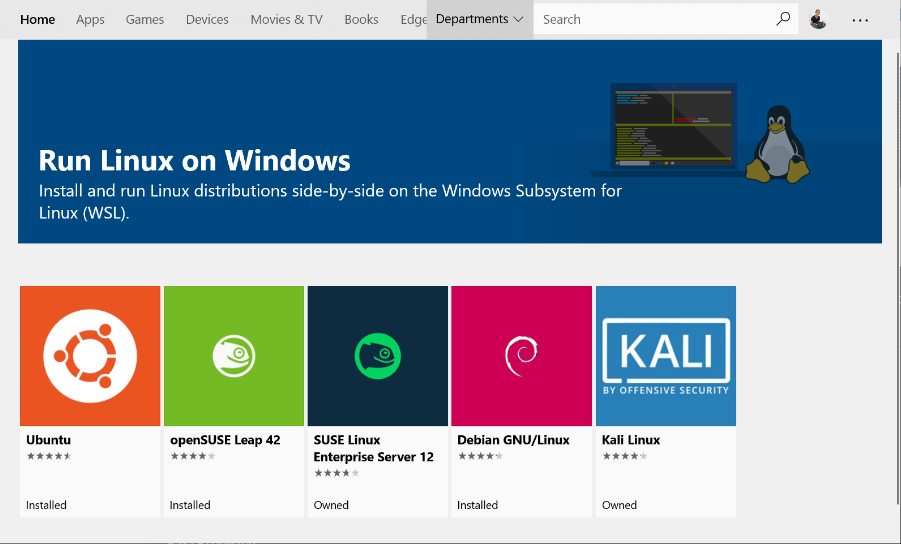
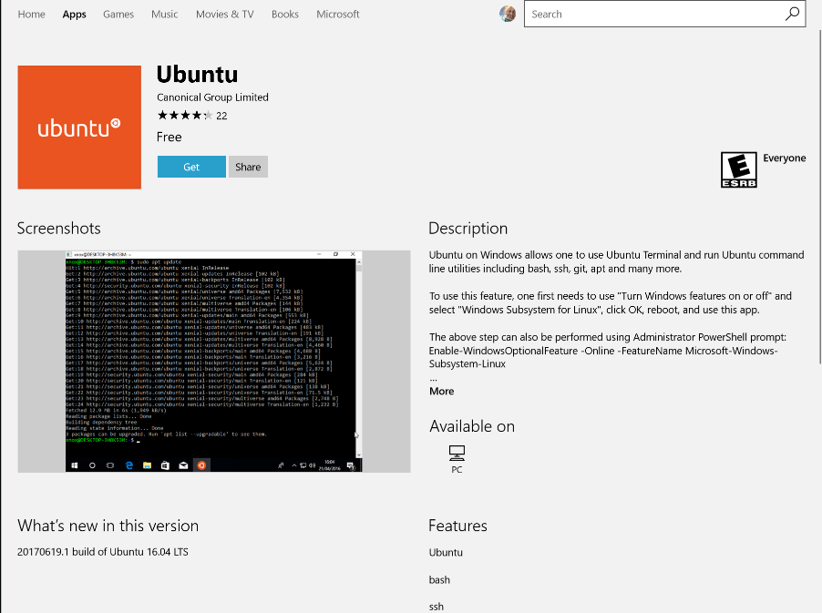

# Compress images

This script will compress all **JPG** and **PNG** files place in the image folder that is next to this script

##  Linux

###  ImageMagick

This script requires ImageMagick
To install open a terminal and run:

####  Arch/Manjaro

```
sudo pacman -Syu imagemagick
```

####  Debian

```
sudo apt-get install imagemagick
```


### :rocket: Run the script

First make the script executable
Open a terminal and run:

```
cd path/to/the/folder/where/the/script/is/
chmod +x script.sh
```

To start the compression
 Open a terminal and run:

```
cd path/to/the/folder/where/the/script/is/
sh script.sh
```

------


##  Windows

### Linux subsystem

To use in windows, requires a Linux subsystem, for that
Open PowerShell as Administrator and run:

```
Enable-WindowsOptionalFeature -Online -FeatureName Microsoft-Windows-Subsystem-Linux
```

( *Restart your computer when prompted)

### Install Linux Distribution

Download and install from the Microsoft Store (*Ubuntu)



From the distro's page, select "Get""



It will show a new terminal and will ask you to create an user and password
(For simplicity we will use user: user, password: user)

###  Install ImageMagick

Open CMD and run:

```
bash
```

Once in bash :

```
sudo apt-get update
sudo apt-get install imagemagick
```

(*Give reply yes when ask)

(**Give password when ask "user")

### Change bash interpreter

```
sudo dpkg-reconfigure dash
```

This will ask if you want to change to dash, reply no

### **:stop_sign: Restart your PC**

Now you should be able to double click on the run file and will compress

------


## :bug: ERRORS

 In case of error check the `error.log` file generated in by this script**